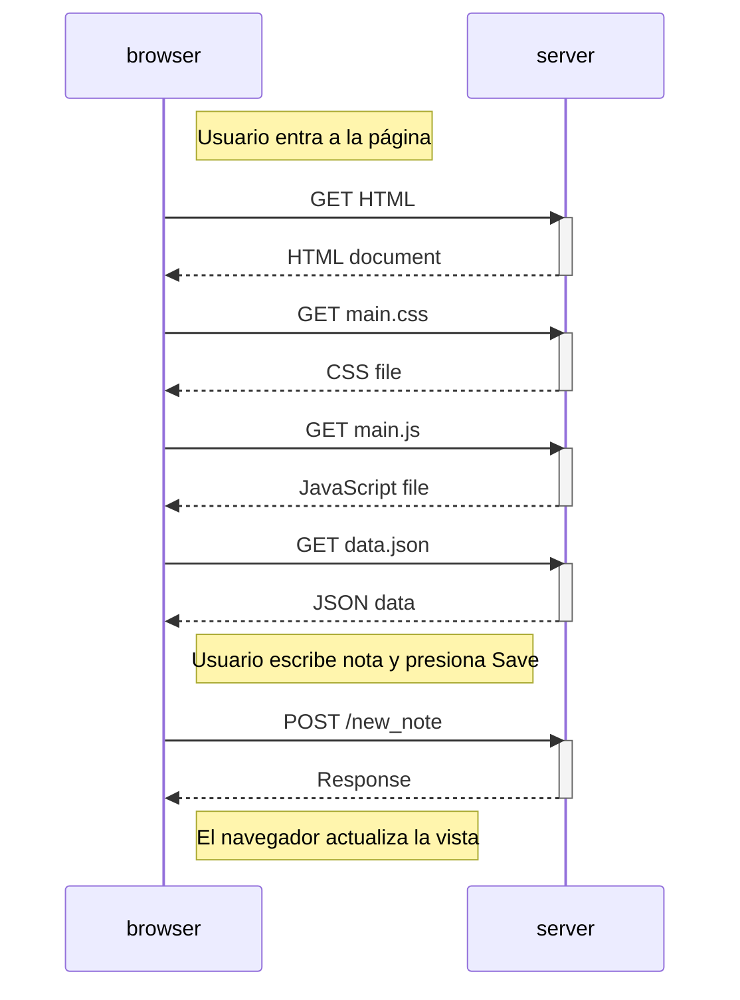

```mermaid
sequenceDiagram
    participant browser
    participant server

    Note right of browser: Usuario entra a la página

    browser->>server: GET HTML
    activate server
    server-->>browser: HTML document
    deactivate server

    browser->>server: GET main.css
    activate server
    server-->>browser: CSS file
    deactivate server

    browser->>server: GET main.js
    activate server
    server-->>browser: JavaScript file
    deactivate server

    browser->>server: GET data.json
    activate server
    server-->>browser: JSON data
    deactivate server

    Note right of browser: Usuario escribe nota y presiona Save

    browser->>server: POST /new_note
    activate server
    server-->>browser: Response
    deactivate server

    Note right of browser: El navegador actualiza la vista
```