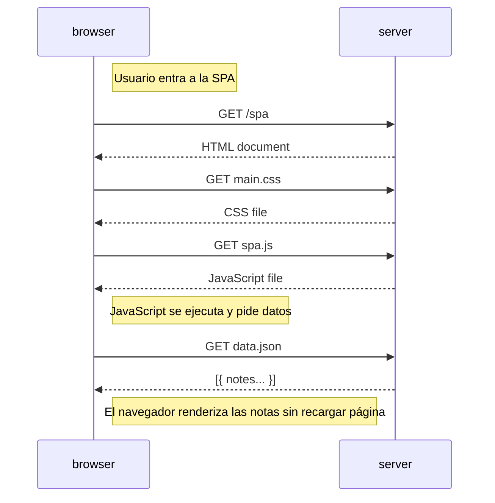

```mermaid
sequenceDiagram
    participant browser
    participant server

    Note right of browser: Usuario entra a la SPA

    browser->>server: GET /spa
    server-->>browser: HTML document

    browser->>server: GET main.css
    server-->>browser: CSS file

    browser->>server: GET spa.js
    server-->>browser: JavaScript file

    Note right of browser: JavaScript se ejecuta y pide datos

    browser->>server: GET data.json
    server-->>browser: [{ notes... }]

    Note right of browser: El navegador renderiza las notas sin recargar página
```