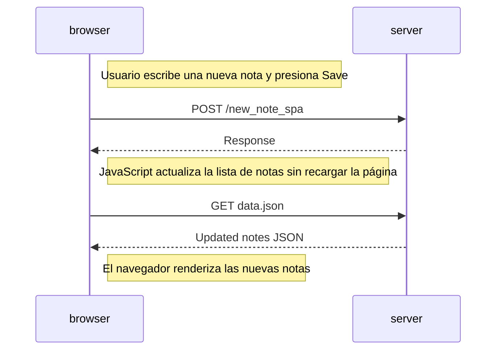

```mermaid
sequenceDiagram
    participant browser
    participant server

    Note right of browser: Usuario escribe una nueva nota y presiona Save

    browser->>server: POST /new_note_spa
    server-->>browser: Response

    Note right of browser: JavaScript actualiza la lista de notas sin recargar la página

    browser->>server: GET data.json
    server-->>browser: Updated notes JSON

    Note right of browser: El navegador renderiza las nuevas notas
```